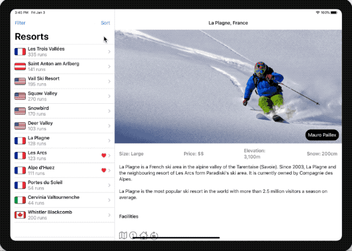

# SnowSeeker 

**Browse the most popular slopes. Project 19 of #100DaysOfSwiftUI.**




#### Technologies used:
- SwiftUI

## Day 96

### SplitView
NavigationView offers functionality similar to SplitViewController (although not yet with all the features of UIKit).

```Swift
 NavigationView {
    Text("Hello, World!")
        .navigationBarTitle("Primary")
    
    Text("Secondary")
}
```

To preview multiple devices (rawValue takes the exact name of the device from the run menu):
```Swift
struct ContentView_Previews: PreviewProvider {
    static var previews: some View {
        Group {
            ContentView()
                .previewDevice(PreviewDevice(rawValue: "iPhone 11 Pro Max"))
                .previewDisplayName("iPhone 11 Pro Max")
            
            ContentView()
                .previewDevice(PreviewDevice(rawValue: "iPad Pro (11-inch)"))
                .previewDisplayName("iPad Pro (11-inch)")
        }
    }
} 
```

### Custom code for different size classes

Group contains no layout information, its parent gets to decide how its text views get arranged:

```Swift
struct ContentView: View {
    @Environment(\.horizontalSizeClass) var sizeClass

    var body: some View {
        Group {
            if sizeClass == .compact {
                VStack {
                    UserView()
                }
            } else {
                HStack {
                    UserView()
                }
            }
        }
    }
}

struct UserView: View {
    var body: some View {
        Group {
            Text("Name: Paul")
            Text("Country: England")
            Text("Pets: Luna, Arya, and Toby")
        }
    }
} 
```

## Day 97

## Day 98

## Day 99

1. Add a photo credit over the ResortView image. The data is already loaded from the JSON for this purpose, so you just need to make it look good in the UI.
2. Fill in the loading and saving methods for Favorites.
3. For a real challenge, let the user sort and filter the resorts in ContentView. For sorting use default, alphabetical, and country, and for filtering let them select country, size, or price.
